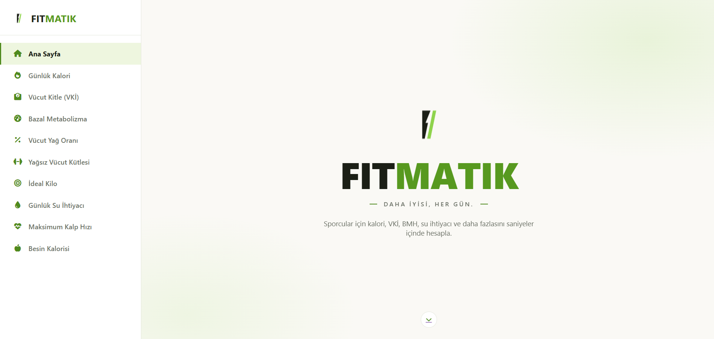
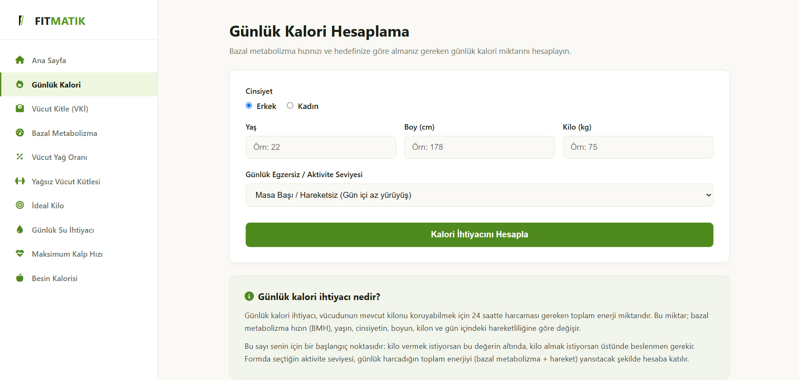
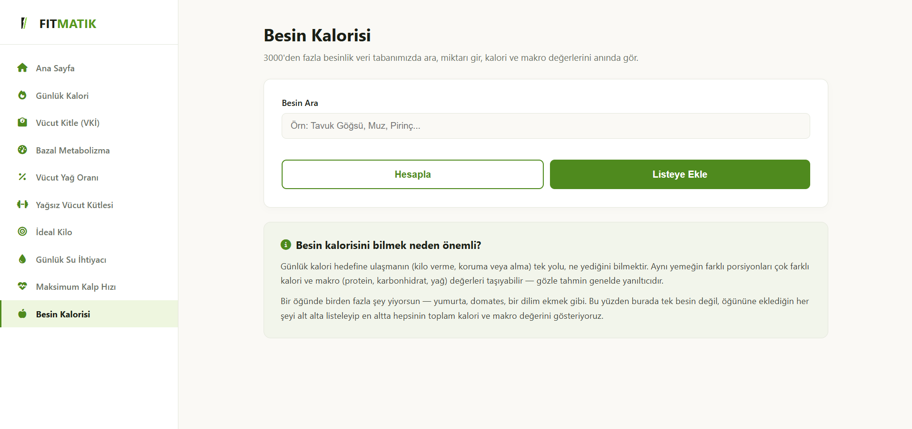
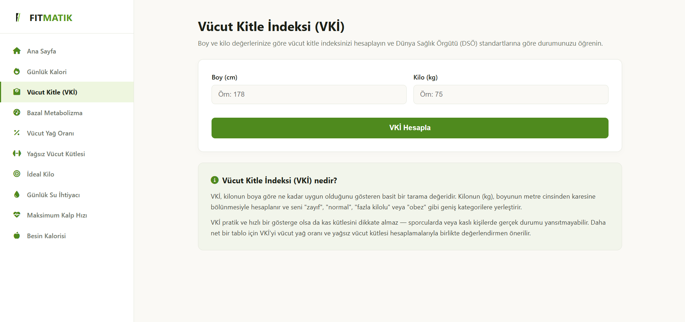

<h1 align="center"> FitMatik </h1>

<p align="center">
  
</p>

<p align="center">
  <strong>Her gün, daha iyisi.</strong>
</p>

<p align="center">
  Spor ve sağlıklı yaşam için günlük kalori, vücut ölçüleri ve temel fitness hesaplamalarını tek bir yerde sunan web uygulaması.
</p>

---

## Ekran Görüntüleri

| Ana Sayfa | Günlük Kalori |
| --------- | ------------- |
|  |  |

| Besin Kalorisi | Vücut Kitle İndeksi |
| -------------- | ------------------- |
|  |  |
---

## Hesaplama Araçları

* **Günlük Kalori Hesaplama:** Yaş, cinsiyet, boy, kilo ve aktivite seviyesine göre günlük kalori ihtiyacını hesaplama
* **Vücut Kitle İndeksi (VKİ):** Boy ve kilo bilgilerine göre VKİ hesaplama ve sonuç değerlendirmesi
* **Bazal Metabolizma Hızı (BMH):** Vücudun dinlenme halindeki tahmini günlük enerji ihtiyacını hesaplama
* **Vücut Yağ Oranı:** Girilen vücut ölçülerine göre tahmini vücut yağ oranını hesaplama
* **Yağsız Vücut Kütlesi:** Vücuttaki yağ dışındaki toplam kütleyi hesaplama
* **İdeal Kilo:** Kullanıcı bilgilerine göre ideal kilo değerini hesaplama
* **Günlük Su İhtiyacı:** Kilo ve aktivite seviyesine göre günlük su ihtiyacını hesaplama
* **Maksimum Kalp Hızı:** Yaşa göre maksimum kalp hızını ve antrenman bölgelerini hesaplama
* **Besin Kalorisi:** Besinler arasında arama yapabilme ve besin miktarına göre kalori, protein, karbonhidrat, yağ ve lif değerlerini görüntüleme

## Kullanıcı Deneyimi

* Tamamen responsive tasarım
* Mobil cihazlara uyumlu arayüz
* Modern ve sade kullanıcı arayüzü
* Kolay kullanılabilir hesaplama formları
* Dinamik sonuç gösterimi
* Hesaplama araçları arasında kolay navigasyon
* Bilgilendirici açıklama alanları

---

## Kullanılan Teknolojiler

  

---

## Proje Yapısı

```text
FitMatik/
│
├── index.html
├── style.css
├── script.js
├── logo.png
├── besin.json
│
├── besin-kalorisi/
│   ├── besin-kalorisi.html
│   ├── besin-kalorisi.css
│   ├── besin-kalorisi.js
│   └── besin-veri.js
│
├── bmh/
│   ├── bmh.html
│   ├── bmh.css
│   └── bmh.js
│
├── gunlukkalori/
│   ├── gunlukkalori.html
│   ├── gunlukkalori.css
│   └── gunlukkalori.js
│
├── ideal-kilo/
│   ├── ideal-kilo.html
│   ├── ideal-kilo.css
│   └── ideal-kilo.js
│
├── kalp-hizi/
│   ├── kalp-hizi.html
│   ├── kalp-hizi.css
│   └── kalp-hizi.js
│
├── su-ihtiyaci/
│   ├── su-ihtiyaci.html
│   ├── su-ihtiyaci.css
│   └── su-ihtiyaci.js
│
├── vki/
│   ├── vki.html
│   ├── vki.css
│   └── vki.js
│
├── yag-orani/
│   ├── yag-orani.html
│   ├── yag-orani.css
│   └── yag-orani.js
│
└── yagsiz-kutle/
    ├── yagsiz-kutle.html
    ├── yagsiz-kutle.css
    └── yagsiz-kutle.js
```

---

## Uyarı

FitMatik tarafından yapılan hesaplamalar **genel bilgilendirme amacıyla** sunulmaktadır.

Hesaplama sonuçları kişiden kişiye değişiklik gösterebilir. Uygulamadaki sonuçlar profesyonel sağlık, beslenme veya spor danışmanlığının yerine geçmez.


# FitMatik

---

## Screenshots

| Homepage | Daily Calories |
| -------- | -------------- |
|  |  |

| Food Calories | Body Mass Index |
| ------------- | --------------- |
|  |  |

---

## Calculation Tools

* **Daily Calorie Calculator:** Calculate daily calorie needs based on age, gender, height, weight, and activity level
* **Body Mass Index (BMI):** Calculate BMI based on height and weight and evaluate the result
* **Basal Metabolic Rate (BMR):** Calculate the estimated daily energy requirements of the body at rest
* **Body Fat Percentage:** Estimate body fat percentage based on body measurements
* **Lean Body Mass:** Calculate total body mass excluding fat
* **Ideal Weight:** Calculate ideal weight based on user information
* **Daily Water Intake:** Calculate daily water requirements based on weight and activity level
* **Maximum Heart Rate:** Calculate maximum heart rate and training zones based on age
* **Food Calories:** Ability to search for foods and view calorie, protein, carbohydrate, fat, and fiber values ​​based on food quantity.
## User Experience

* Fully responsive design
* Mobile-friendly interface
* Modern and clean user interface
* Easy-to-use calculation forms
* Dynamic result display
* Easy navigation between calculation tools
* Informative explanation sections

---

## Technologies Used

, , 

---

## Project Structure

```text
FitMatik/
│
├── index.html
├── style.css
├── script.js
├── logo.png
├── besin.json
│
├── besin-kalorisi/
│   ├── besin-kalorisi.html
│   ├── besin-kalorisi.css
│   ├── besin-kalorisi.js
│   └── besin-veri.js
│
├── bmh/
│   ├── bmh.html
│   ├── bmh.css
│   └── bmh.js
│
├── gunlukkalori/
│   ├── gunlukkalori.html
│   ├── gunlukkalori.css
│   └── gunlukkalori.js
│
├── ideal-kilo/
│   ├── ideal-kilo.html
│   ├── ideal-kilo.css
│   └── ideal-kilo.js
│
├── kalp-hizi/
│   ├── kalp-hizi.html
│   ├── kalp-hizi.css
│   └── kalp-hizi.js
│
├── su-ihtiyaci/
│   ├── su-ihtiyaci.html
│   ├── su-ihtiyaci.css
│   └── su-ihtiyaci.js
│
├── vki/
│   ├── vki.html
│   ├── vki.css
│   └── vki.js
│
├── yag-orani/
│   ├── yag-orani.html
│   ├── yag-orani.css
│   └── yag-orani.js
│
└── yagsiz-kutle/
    ├── yagsiz-kutle.html
    ├── yagsiz-kutle.css
    └── yagsiz-kutle.js
```

---

## Disclaimer

The calculations provided by FitMatik are intended for **general informational purposes only**.

Results may vary from person to person and should not be considered a substitute for professional medical, nutritional, or fitness advice.
